# Robotic palletization using computer vision

<i>Object grasping demo (2x speed)</i>

Here is the code I wrote as a part of my Master's thesis, available [here](https://zir.nsk.hr/en/islandora/object/etfos%3A3613) and written in Croatian.

Presented here is a system for robotic palletization using computer vision algorithms. The system consists of the [UR5](https://www.universal-robots.com/products/ur5-robot/) robotic arm, [Robotiq 3-Finger](https://robotiq.com/products/3-finger-adaptive-robot-gripper) gripper and the [Intel RealSense L515](https://www.intelrealsense.com/lidar-camera-l515/) lidar camera. We use the [ROS](https://www.ros.org/) environment, [Gazebo](https://gazebosim.org/home) for simulation and [Open3D](http://www.open3d.org/) for working with pointclouds.

## Detection

Our task here is to detect an object in the workspace that we want to grab and move. For perceiving the workspace we use the mentioned RealSense lidar camera. From this camera we get an RGBD image from which we can generate a pointcloud. An example of the generated pointcloud is shown below, as are the further steps required to detect an object.

NOTE: caption for the image is located *below* the image.

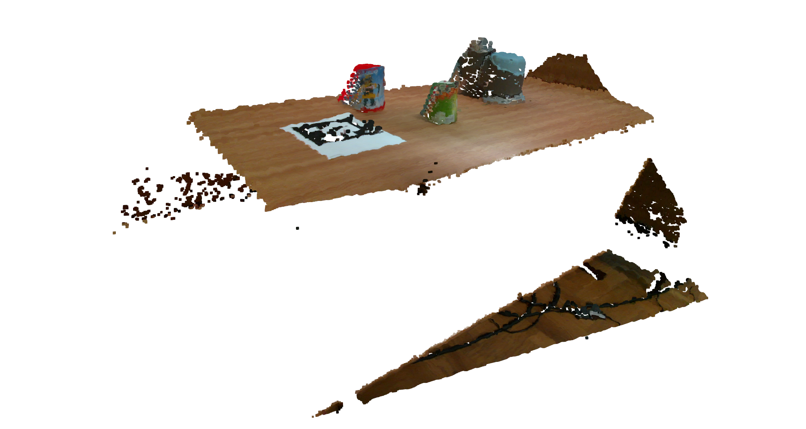

<i>Generated Pointcloud from the RGBD image of the workspace.</i>

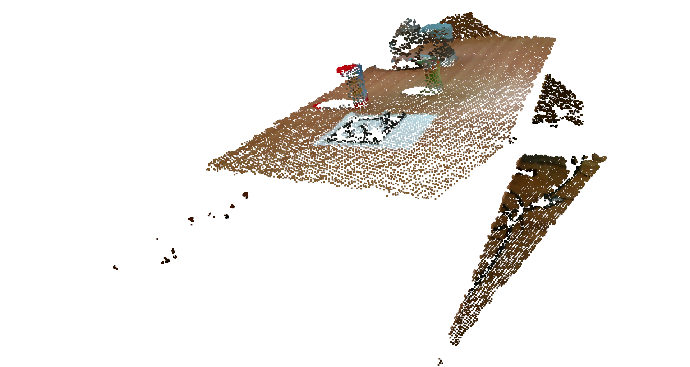

<i>Pointcloud after Voxel downsampling.</i>

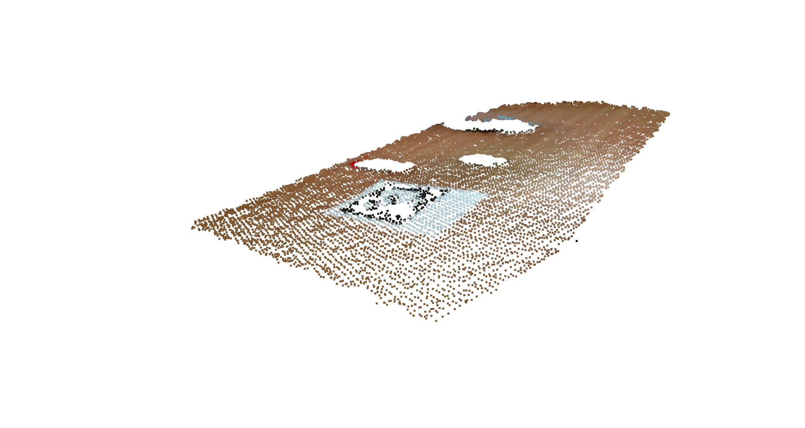

<i>Dominant plane found by RANSAC.</i>

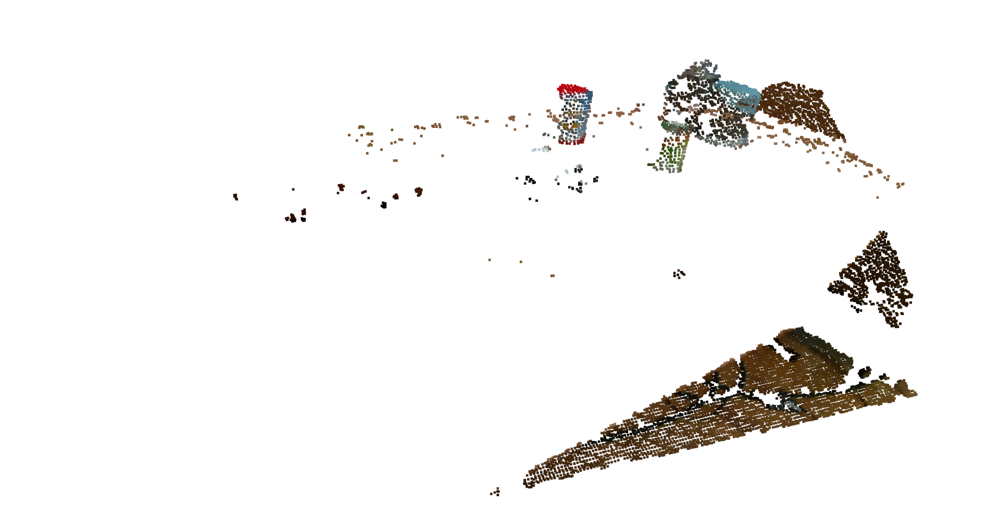

<i>Pointcloud after we remove the dominant plane.</i>

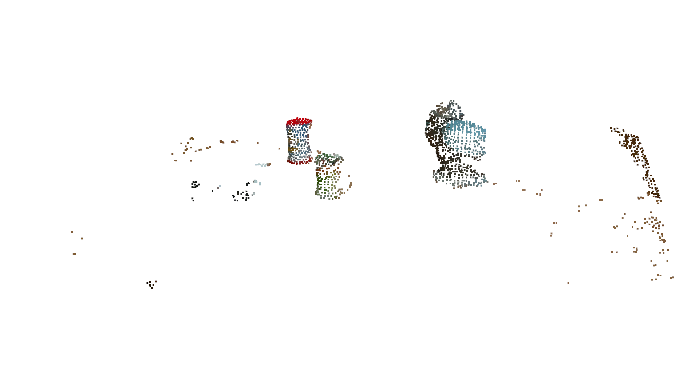

<i>Pointcloud after the removal of far away points.</i>

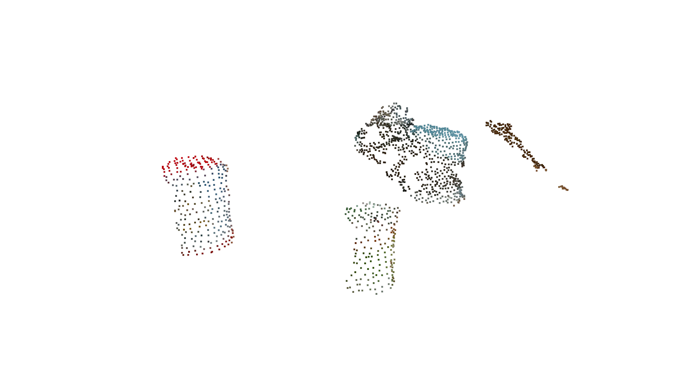

<i>Cleaned-up pointcloud. Noise is removed by removing statistical outliers.</i>

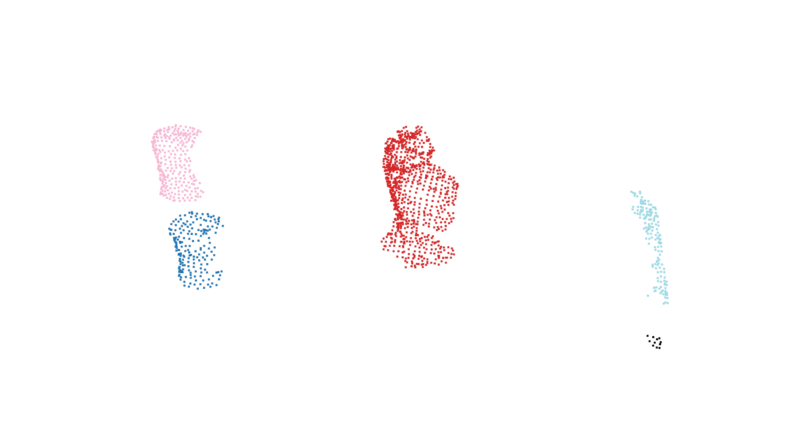

<i>Remaining objects inside the pointcloud neatly grouped. These are possible candidates that could be the desired object we need to grasp.</i>

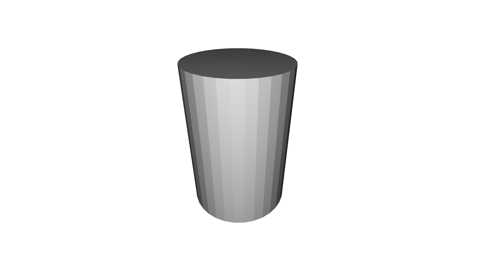

<i>The model of the object we want to grasp is displayed here. Object in the pointcloud will be tested for similarity with this object.</i>

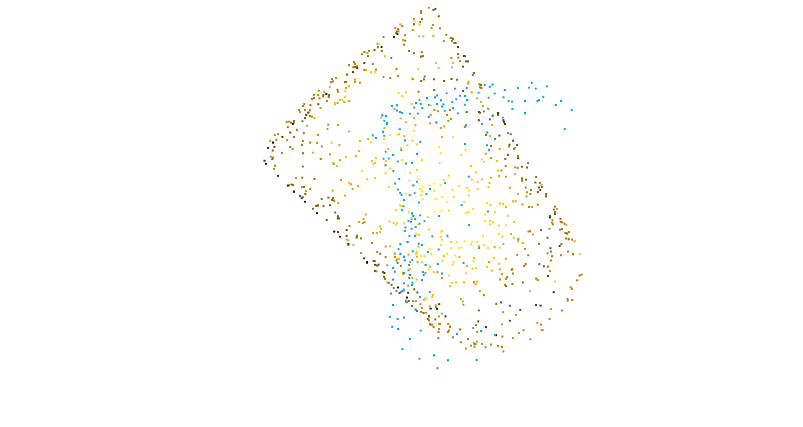

<i>Pointcloud of the object that is being tested together with the model of the object in the database.</i>

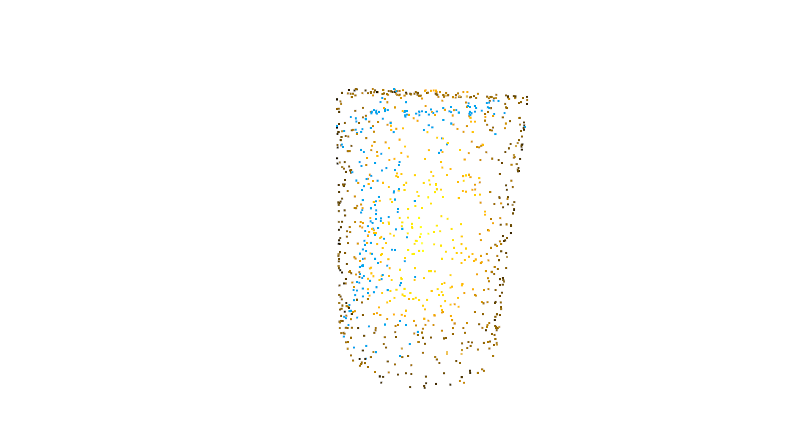

<i>Pointclouds lined-up after ICP. Using ICP we calculate the correct position of the object in the workspace.</i>

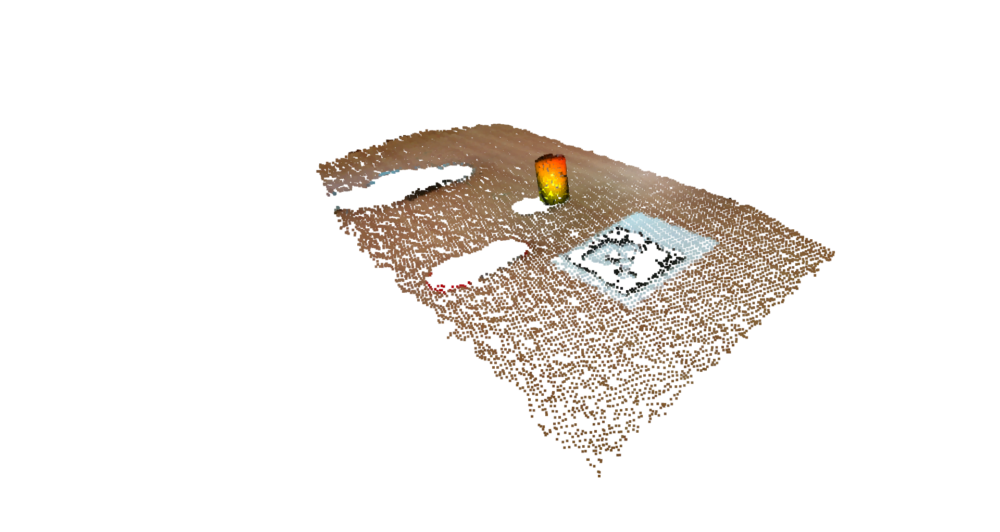

<i>The object visualized in the workspace (the dominant plane).</i>

## How to init

Clone the repositories in their respective directories (blank folders):
- https://github.com/matthias-mayr/robotiq
- https://github.com/fmauch/universal_robot.git (branch calibration-devel)
- https://github.com/UniversalRobots/Universal_Robots_ROS_Driver

Install the dependencies & Build the workspace
